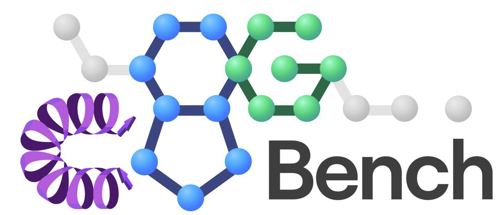
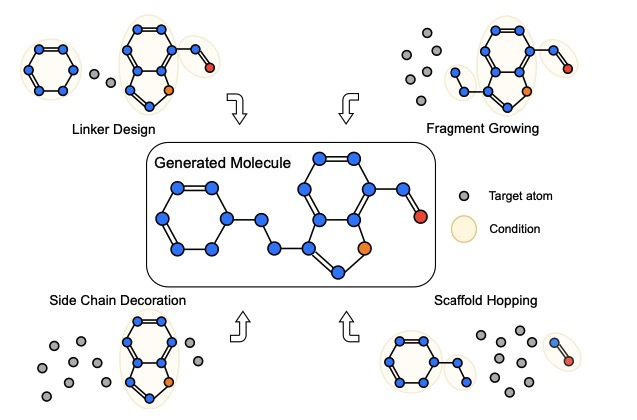

<p align="center">
    
    <br/>
</p>


<a href="https://pytorch.org/get-started/locally/"></a>
[](https://arxiv.org/abs/2406.10840)
[](https://github.com/deepmodeling)
<a href="https://img.shields.io/github/stars/EDAPINENUT/CBGBench" alt="arXiv">
    </a>
</p>

*CBGBench: Complex Binding Graph Benchmark* is a benchmark for generative target-aware molecule design.

**[Paper [DiffBP]](https://arxiv.org/abs/2211.11214)** | **[Paper [D3FG]](https://arxiv.org/abs/2306.13769)** | **[Benchmark](https://arxiv.org/abs/2406.10840)**

> [!NOTE]
> - *Feb. 2025:* **Accepted by ICLR2025 as [spotlight presentation](https://openreview.net/forum?id=mOpNrrV2zH)**. Congrats!
> - *Dec. 2024:* We have uploaded the **molecules generated by the SOTA Methods** (LiGAN, Pocket2Mol, TargetDiff, D3FG, DecomptDiff, VoxBind, and MolCraft) for evaluation. For most of them, the generated number is 100/pockets, while for some 200 (2 times) in order to check if it is necessary to report multi-seeds' results. If it is useful for your research, pls download from the [Google Drive](https://drive.google.com/drive/folders/14A_fOf_1088YHedz7Cbe-SIckZ0ltJGQ) and cite the paper.
> - *Oct. 2024:* [**CBGBench** paper v3](https://arxiv.org/abs/2406.10840) has just integrated the state-of-the-art [MolCraft](https://arxiv.org/abs/2404.12141) and [VoxBind](https://arxiv.org/html/2405.03961v1) into evaluation, and the integration of their codes is in process.
> - *Sep. 2024:* **CBGBench** has joined the DeepModeling community, a community devoted to AI for science, as a sandbox-level project. [Learn more about DeepModeling](https://github.com/deepmodeling/community)


## Introduction

This is the official code repository of the paper 'CBGBench: Fill in the Blank of Protein-Molecule Binding Graph', which aims to unify target-aware molecule design with single code implementation. Until now, we have included 7 methods as shown below:
| Model | Paper link | Github |
|------------|---------------------------------------------|-------------------------------------------|
| Pocket2Mol | https://arxiv.org/abs/2205.07249 | https://github.com/pengxingang/Pocket2Mol |
| GraphBP | https://arxiv.org/abs/2204.09410 | https://github.com/divelab/GraphBP |
| DiffSBDD | https://arxiv.org/abs/2210.13695 | https://github.com/arneschneuing/DiffSBDD |
| DiffBP | https://arxiv.org/abs/2211.11214 | Here is the official implementation. |
| TargetDiff | https://arxiv.org/abs/2303.03543 | https://github.com/guanjq/targetdiff |
| FLAG | https://openreview.net/forum?id=Rq13idF0F73 | https://github.com/zaixizhang/FLAG |
| D3FG | https://arxiv.org/abs/2306.13769 | Here is the official implementation. |

These models are initially established for `de novo` molecule generation, and we extend more tasks including `linker design`, `fragment growing`, `scaffold hopping`, and `side chain decoration`.
<p align="center">
    
    <br/>
</p>

## Installation

#### Create environment with basic packages.

```
conda env create -f environment.yml
conda activate cbgbench
```

#### Install pytorch and torch_geometric

```
conda install pytorch==2.0.1 torchvision==0.15.2 torchaudio==2.0.2 pytorch-cuda=11.8 -c pytorch -c nvidia
conda install pyg pytorch-scatter pytorch-cluster -c pyg
```

#### Install tools for chemistry

```
# install rdkit, efgs, obabel, etc.
pip install --use-pep517 EFGs
pip install biopython
pip install lxml
conda install rdkit openbabel tensorboard tqdm pyyaml easydict python-lmdb -c conda-forge

# install plip
mkdir tools
cd tools
git clone https://github.com/pharmai/plip.git
cd plip
python setup.py install
alias plip='python plip/plip/plipcmd.py'
cd ..

### Note that if there is an error in setup.py, it can be ignored as long as openbabel is installed.

# install docking tools
conda install -c conda-forge numpy swig boost-cpp sphinx sphinx_rtd_theme
python -m pip install git+https://github.com/Valdes-Tresanco-MS/AutoDockTools_py3
pip install meeko==0.1.dev3 scipy pdb2pqr vina

# If you are unable to install vina, you can try: conda install vina
# If you encounter the following error:
# ImportError: libtiff.so.5: cannot open shared object file: No such file or directory
# Please try the following steps to resolve it:
pip uninstall pillow
pip install pillow
```

## Prepare Dataset

### CrossDocked2020

#### 1. Download processed datasets

(i) Download the processed dataset from [Google Drive](https://drive.google.com/drive/folders/1wm5_rMbemxqMiTxoBr_V-Vt5NyNtdZT7?usp=share_link). For each dataset, it corresponds to different methods and tasks. Please refer to the Table below to find the processed data that you need to use. Note that to train D3FG, it is a two-stage model that firstly generates functional groups and then generates linker atoms, so we named the two-stage model 'D3FG_fg' and 'D3FG_linker', and the training data is different for them.

Table: The data file name corresponding to different methods and tasks.
| model | task | file name |
|-------------|------------|---------------------------------------------------------------------------|
| Pocket2Mol | de novo | data/pl/crossdocked_v1.1_rmsd1.0_pocket10_processed_fullatom.lmdb |
| GraphBP | de novo | data/pl/crossdocked_v1.1_rmsd1.0_pocket10_processed_fullatom.lmdb |
| DiffSBDD | de novo | data/pl/crossdocked_v1.1_rmsd1.0_pocket10_processed_fullatom.lmdb |
| DiffBP | de novo | data/pl/crossdocked_v1.1_rmsd1.0_pocket10_processed_fullatom.lmdb |
| TargetDiff | de novo | data/pl/crossdocked_v1.1_rmsd1.0_pocket10_processed_fullatom.lmdb |
| FLAG | de novo | data/pl_arfg/crossdocked_v1.1_rmsd1.0_pocket10_processed_arfuncgroup.lmdb |
| D3FG | de novo | data/pl_fg/crossdocked_v1.1_rmsd1.0_pocket10_processed_funcgroup.lmdb |
| Pocket2Mol | fragment | data/pl_decomp/crossdocked_v1.1_rmsd1.0_pocket10_processed_frag.lmdb |
| GraphBP | fragment | data/pl_decomp/crossdocked_v1.1_rmsd1.0_pocket10_processed_frag.lmdb |
| DiffSBDD | fragment | data/pl_decomp/crossdocked_v1.1_rmsd1.0_pocket10_processed_frag.lmdb |
| DiffBP | fragment | data/pl_decomp/crossdocked_v1.1_rmsd1.0_pocket10_processed_frag.lmdb |
| TargetDiff | fragment | data/pl_decomp/crossdocked_v1.1_rmsd1.0_pocket10_processed_frag.lmdb |
| Pocket2Mol | linker | data/pl_decomp/crossdocked_v1.1_rmsd1.0_pocket10_processed_linker.lmdb |
| GraphBP | linker | data/pl_decomp/crossdocked_v1.1_rmsd1.0_pocket10_processed_linker.lmdb |
| DiffSBDD | linker | data/pl_decomp/crossdocked_v1.1_rmsd1.0_pocket10_processed_linker.lmdb |
| DiffBP | linker | data/pl_decomp/crossdocked_v1.1_rmsd1.0_pocket10_processed_linker.lmdb |
| TargetDiff | linker | data/pl_decomp/crossdocked_v1.1_rmsd1.0_pocket10_processed_linker.lmdb |
| Pocket2Mol | scaffold | data/pl_decomp/crossdocked_v1.1_rmsd1.0_pocket10_processed_scaffold.lmdb |
| GraphBP | scaffold | data/pl_decomp/crossdocked_v1.1_rmsd1.0_pocket10_processed_scaffold.lmdb |
| DiffSBDD | scaffold | data/pl_decomp/crossdocked_v1.1_rmsd1.0_pocket10_processed_scaffold.lmdb |
| DiffBP | scaffold | data/pl_decomp/crossdocked_v1.1_rmsd1.0_pocket10_processed_scaffold.lmdb |
| TargetDiff | scaffold | data/pl_decomp/crossdocked_v1.1_rmsd1.0_pocket10_processed_scaffold.lmdb |
| Pocket2Mol | side chain | data/pl_decomp/crossdocked_v1.1_rmsd1.0_pocket10_processed_sidechain.lmdb |
| GraphBP | side chain | data/pl_decomp/crossdocked_v1.1_rmsd1.0_pocket10_processed_sidechain.lmdb |
| DiffSBDD | side chain | data/pl_decomp/crossdocked_v1.1_rmsd1.0_pocket10_processed_sidechain.lmdb |
| DiffBP | side chain | data/pl_decomp/crossdocked_v1.1_rmsd1.0_pocket10_processed_sidechain.lmdb |
| TargetDiff | side chain | data/pl_decomp/crossdocked_v1.1_rmsd1.0_pocket10_processed_sidechain.lmdb |

(ii) Copy the datasets to `./data` dir, in which the complete data file directory will look like

```
- CGBBench
    - data
        - pl
            - crossdocked_name2id.pt
            - crossdocked_v1.1_rmsd1.0_pocket10_processed_fullatom.lmdb
            - crossdocked_v1.1_rmsd1.0_pocket10_processed_linker.lmdb
        - pl_arfg
            - crossdocked_name2id_arfuncgroup.pt
            - crossdocked_v1.1_rmsd1.0_pocket10_processed_arfuncgroup.lmdb
        - pl_decomp
            - crossdocked_name2id_frag.pt
            - crossdocked_name2id_linker.pt
            - crossdocked_name2id_scaffold.pt
            - crossdocked_name2id_sidechain.pt
            - crossdocked_v1.1_rmsd1.0_pocket10_processed_frag.lmdb
            - crossdocked_v1.1_rmsd1.0_pocket10_processed_linker.lmdb
            - crossdocked_v1.1_rmsd1.0_pocket10_processed_scaffold.lmdb
            - crossdocked_v1.1_rmsd1.0_pocket10_processed_sidechain.lmdb
        - pl_fg
            - crossdocked_name2id_funcgroup.pt
            - crossdocked_v1.1_rmsd1.0_pocket10_processed_funcgroup.lmdb
```

#### 2. Download raw data and prepare from scratch

(i) Download `crossdocked_v1.1_rmsd1.0.tar.gz` from [TargetDiff Drive](https://drive.google.com/drive/folders/1j21cc7-97TedKh_El5E34yI8o5ckI7eK), and copy it to `./raw_data/` with

```
mkdir raw_data
tar -xzvf crossdocked_v1.1_rmsd1.0.tar.gz ./raw_data
```

(ii) Run the following:

```
python ./scripts/extract_pockets.py --source raw_data/crossdocked_v1.1_rmsd1.0 --dest raw_data/crossdocked_v1.1_rmsd1.0_pocket10
```

(iii) In training, the Dataset will be prepared for each task. Please refer to `Training`.

### ADRB1 and DRD3 Targets

#### Download processed targets.

Also, you can download the processes targets file `case_study` from [Google Drive](https://drive.google.com/drive/folders/1YulDlChalaIjqRJjCyOFSY1-KoZ-hYCP?usp=share_link), and copy it to the `./data` directory, which will lead the dir to

```
- CGBBench
    - data
        - case_study
            - processed
                - case_study_processed_fullatom.lmdb
                - case_study_processed_funcgroup.lmdb
                - case_study_name2id.pt
                ...
```

## Training

#### 1. If you want to train from scratch, you can run the following

```
python train.py --config ./configs/{task}/train/{method}.yml --logdir ./logs/{task}/{method}
```

{task} can be replaced with `denovo`, `linker`, `frag`, `scaffold` and `sidechain`, and {method} can be replaced with the model name. The following table gives the detailed method-task pairs and the replacement.

Table: method-task pairs used to train from scratch.
| Method | Task | {method} + {task} |
|------------|-----------------------|-----------------------------------------|
| Pocket2Mol | de novo | pocket2mol + denovo |
| GraphBP | de novo | graphbp + denovo |
| DiffSBDD | de novo | diffsbdd + denovo |
| DiffBP | de novo | diffbp + denovo |
| TargetDiff | de novo | targetdiff + denovo |
| FLAG | de novo | flag + denovo |
| D3FG | de novo | d3fg_fg + denovo ; d3fg_linker + denovo |
| Pocket2Mol | linker design | pocket2mol + linker |
| GraphBP | linker design | graphbp + linker |
| DiffSBDD | linker design | diffsbdd + linker |
| DiffBP | linker design | diffbp + linker |
| TargetDiff | linker design | targetdiff + linker |
| Pocket2Mol | fragment growing | pocket2mol + frag |
| GraphBP | fragment growing | graphbp + frag |
| DiffSBDD | fragment growing | diffsbdd + frag |
| DiffBP | fragment growing | diffbp + frag |
| TargetDiff | fragment growing | targetdiff + frag |
| Pocket2Mol | scaffold hopping | pocket2mol + scaffold |
| GraphBP | scaffold hopping | graphbp + scaffold |
| DiffSBDD | scaffold hopping | diffsbdd + scaffold |
| DiffBP | scaffold hopping | diffbp + scaffold |
| TargetDiff | scaffold hopping | targetdiff + scaffold |
| Pocket2Mol | side chain decoration | pocket2mol + sidechain |
| GraphBP | side chain decoration | graphbp + sidechain |
| DiffSBDD | side chain decoration | diffsbdd + sidechain |
| DiffBP | side chain decoration | diffbp + sidechain |
| TargetDiff | side chain decoration | targetdiff + sidechain |

Note that D3FG and FLAG are not compatible with the extended tasks, and D3FG utilizes 2-stage-training strategies, so if you want to train D3FG yourself, you need to run:

```
python train.py --config ./configs/denovo/train/d3fg_fg.yml --logdir ./logs/denovo/d3fg_fg
python train.py --config ./configs/denovo/train/d3fg_linker.yml --logdir ./logs/denovo/d3fg_linker
```

#### 2. Also, you can use our pretrained ones from Google Drives [TODO: Release the pretrained models], the corresponding pretrained data file names to different tasks and models are provided in the table below:

TODO: Table with pretrained models

Download the pretrained `.pt` checkpoints that you need, and copy them into `./logs/`, which will lead to the following directory structure:

```
# TODO
- CBGBench
    - logs
        - denovo
            - d3fg_fg
                - pretrain
                    - checkpoints
                        - 951000.pt
            - d3fg_linker
                - pretrain
                    - checkpoints
                        - 4840000.pt
            - diffbp
                - pretrain
                    - checkpoints
                        - 4848000.pt
            ...
        - frag
            - diffbp
                - pretrain
                    - checkpoints
                        - 476000.pt
            ...
        ...
```

## Generation on test sets

Once the model is trained, you can draw samples from them on the test pockets, with the following:

```
bash generate.sh --method {method} --task {task} --tag {tag} --checkpoint {ckpt_number}
```

In the command, {method} and {task} pair can be found in the former Table on method-task pairs. {tag} should be replaced with `selftrain` or `pretrain`, according to the checkpoints you use.
If the --checkpoint parameter is provided without a number, it will automatically find the latest `.pt` file. If a number is provided, it will use the specified checkpoint file.

For example, if you want to generate samples on the test set for _de novo_ design with _self-trained_ _targetdiff_ model, you can run:

```
bash generate.sh --method targetdiff --task denovo --tag selftrain --checkpoint
```

Or if you want to test the checkpoint of the 100000-th.

```
bash generate.sh --method targetdiff --task denovo --tag selftrain --checkpoint 100000
```

Note that `D3FG` uses a two-step generation strategy, so the command should be

```
bash generate.sh --method d3fg_fg --task denovo --tag {tag} --checkpoint  # generate the functional groups
bash generate.sh --method d3fg_linker --task denovo --tag {tag} --checkpoint # generate the linkers
```
We give the selected generated molecules by state-of-the-art methods in our benchmark for the de novo task, which can be downloaded from the [Google Drive](https://drive.google.com/drive/folders/14A_fOf_1088YHedz7Cbe-SIckZ0ltJGQ). You can directly download them for evaluation. Besides, in each directory, there are metrics files ending with `.pt` as the raw evaluation results.

## Evaluation

Run the following:

```
cd evaluate_scripts
bash evaluate.sh --method {method} --task {task} --tag {tag}
```

For example, if you have trained TargetDiff by yourself, run

```
bash evaluate.sh --method targetdiff --task denovo --tag selftrain
bash evaluate.sh --method targetdiff --task frag --tag selftrain
bash evaluate.sh --method targetdiff --task linker --tag selftrain
bash evaluate.sh --method targetdiff --task scaffold --tag selftrain
bash evaluate.sh --method targetdiff --task sidechain --tag selftrain
```

Or if you have downloaded pretrained models, please run

```
cd evaluate_scripts
bash bash evaluate.sh --method {method} --task {task} --tag pretrained
```

## TODO List

1. Use the pretrained models to generate molecules on real-world targets flexibly.

2. Include more models, such as 3DSBDD, DecompDiff, VoxMol, and LiGAN.

3. Release the pretrained models, test the feasibility and reproducivity once the paper is published.

## Contribution

The codebase is initialized by Haitao Lin and Odin Zhang, with the [CBGbench v1](https://arxiv.org/html/2406.10840v2) as our motivation; The subsequent running of the code repository will be managed by Haitao Lin, Guojiang Zhao and his team of [DP Technology](https://www.dp.tech).

If you find the repository is helpful to your research or projects, please cite to our benchmark paper as reference:

```
@inproceedings{
lin2025cbgbench,
title={{CBGB}ench: Fill in the Blank of Protein-Molecule Complex Binding Graph},
author={Haitao Lin and Guojiang Zhao and Odin Zhang and Yufei Huang and Lirong Wu and Cheng Tan and Zicheng Liu and Zhifeng Gao and Stan Z. Li},
booktitle={The Thirteenth International Conference on Learning Representations},
year={2025},
url={https://openreview.net/forum?id=mOpNrrV2zH}
}
```

And our former works of DiffBP and D3FG:

```
@Article{lin2025diffbp,
author ="Lin, Haitao and Huang, Yufei and Zhang, Odin and Ma, Siqi and Liu, Meng and Li, Xuanjing and Wu, Lirong and Wang, Jishui and Hou, Tingjun and Li, Stan Z.",
title  ="DiffBP: generative diffusion of 3D molecules for target protein binding",
journal  ="Chem. Sci.",
year  ="2025",
volume  ="16",
issue  ="3",
pages  ="1417-1431",
publisher  ="The Royal Society of Chemistry",
doi  ="10.1039/D4SC05894A",
url  ="http://dx.doi.org/10.1039/D4SC05894A",
}

@inproceedings{
    lin2023functionalgroupbased,
    title={Functional-Group-Based Diffusion for Pocket-Specific Molecule Generation and Elaboration},
    author={Haitao Lin and Yufei Huang and Odin Zhang and Yunfan Liu and Lirong Wu and Siyuan Li and Zhiyuan Chen and Stan Z. Li},
    booktitle={Thirty-seventh Conference on Neural Information Processing Systems},
    year={2023},
    url={https://openreview.net/forum?id=lRG11M91dx}
}
```

----
## Licence
This project is licensed under the terms of the GPL-3.0 license.
